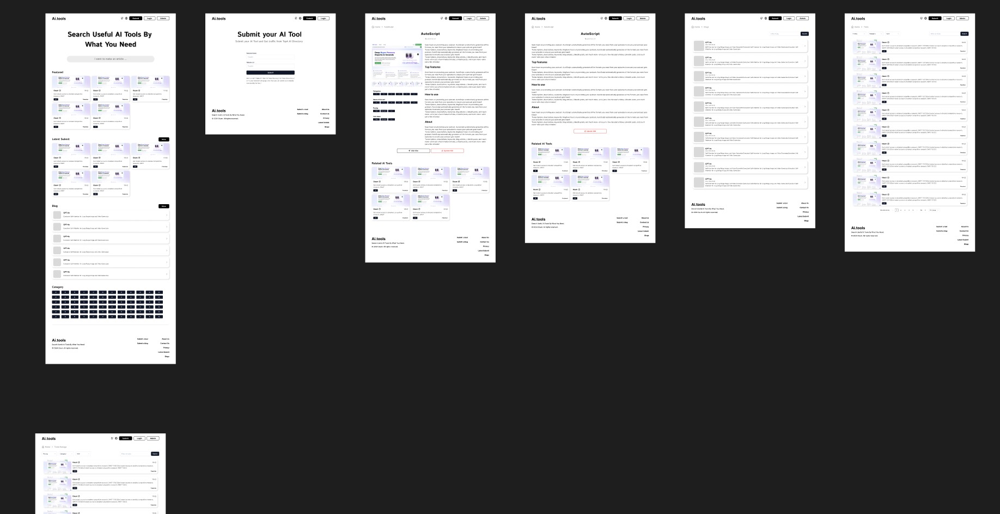

<div align="center">
  <a href="https://github.com/someu/aigotools.git">
    
  </a>
  <h2 align="center">AigoTools</h2>
  <a href="README.md">
    English
  </a>
  <a href="README.zh-CN.md">
    简体中文
  </a>
  <br>
  <br>
</div>

AigoToolsは、サイト管理と自動インクルージョン機能を内蔵し、ユーザーが迅速にウェブサイトディレクトリを作成および管理できるように支援します。国際化、SEO、複数の画像ストレージソリューションを提供し、ユーザーが自分のナビゲーションサイトを迅速にデプロイおよび立ち上げることができます。

こちらを訪問してください: <a href="https://www.aigotools.com/cn">www.aigotools.com</a>

https://github.com/someu/aigotools/assets/33251742/00d39041-a216-4105-884b-bd19cde6c706


## 目次

- [目次](#目次)
- [特徴](#特徴)
- [デプロイメント](#デプロイメント)
  - [前提条件](#前提条件)
  - [ローカルデプロイメント](#ローカルデプロイメント)
  - [ホスティングサービスデプロイメント](#ホスティングサービスデプロイメント)
- [開発](#開発)
- [Figmaリソース](#figmaリソース)
- [メンテナー](#メンテナー)
- [貢献方法](#貢献方法)
- [お問い合わせ](#お問い合わせ)
- [ライセンス](#ライセンス)

## 特徴

- **サイト管理**
- **自動サイト情報収集（playwright、jina、openaiを使用）**
- **ユーザー管理（clerkを使用）**
- **国際化**
- **ダーク/ライトテーマの切り替え**
- **SEO最適化**
- **複数の画像ストレージソリューション（ローカルのminio、AWS S3、Tencent Cloud COS）**

## デプロイメント

このプロジェクトは、メインのナビゲーションサイト（`packages/aigotools`）とインクルージョンサービス（`packages/crawler`）の2つの部分で構成されており、Zeaburなどのホスティングサービスを介してデプロイするか、`docker-compose`を使用してローカルマシンに直接デプロイできます。

### 前提条件

- https://clerk.com/ でアプリケーションを作成し、管理バックエンドにログインするための管理者としてユーザーを追加します。
- `OpenAI apiKey`と`jina apiKey`を取得します。これらはサイトのインクルージョンに使用されます。
- MongoDBとRedisデータベースをセットアップします。

### ローカルデプロイメント

1. リポジトリをクローンします：

   ```bash
   git clone https://github.com/someu/aigotools.git
   cd aigotools
   ```

2. 環境変数を設定します：
   `packages/aigotools`と`packages/crawler`の`.env`ファイルを`.env.prod`にコピーします。

   ```bash
   cp packages/aigotools/.env packages/aigotools/.env.prod
   cp packages/crawler/.env packages/crawler/.env.prod
   ```

   設定ファイルを変更します。

3. プロジェクトを開始します：

   ```bash
   docker-compose up -d
   ```

**注：画像ストレージにminioを使用する場合、プロジェクトを開始する際に最初はminioの認証設定を空のままにしておくことができます。プロジェクトを実行した後、minio管理バックエンドにアクセスしてBucket、ACCESS_KEY、SECRET_KEYを作成し、Bucketに公開読み取り権限を有効にし、設定ファイルを更新してプロジェクトを再起動します。**

### ホスティングサービスデプロイメント

[](https://zeabur.com/templates/9PSGFO?referralCode=someu)

ドキュメントを参照してください：[zeabur-deploy.md](./docs/zeabur-deploy.md)

Zeaburデモリンク：https://aigotools.zeabur.app/

## 開発

1. リポジトリをクローンします：

   ```bash
   git clone https://github.com/someu/aigotools.git
   cd aigotools
   ```

2. 依存関係をインストールします：

   ```bash
   pnpm i
   ```

3. 環境変数を設定します：
   `packages/aigotools`と`packages/crawler`の`.env`ファイルを`.env.local`にコピーし、設定ファイルを変更します。

   ```bash
   cp packages/aigotools/.env packages/aigotools/.env.local
   cp packages/crawler/.env packages/crawler/.env.local
   ```

4. プロジェクトを開始します：
   `packages/aigotools`と`packages/crawler`にそれぞれ移動します。

   ```bash
   pnpm run dev
   ```

## Figmaリソース

このプロジェクトのデザインドラフトもオープンソース化しています。このプロジェクトのUIとコードを使用して、自分のウェブサイトを開発することができます。

https://www.figma.com/community/file/1385200592630492334/aigotools




## メンテナー

[@someu](https://github.com/someu)。

## 貢献方法

あなたの参加を心から歓迎します！[Issueを提出する](https://github.com/someu/aigotools/issues/new)か、Pull Requestを送信してください。

## お問い合わせ

ご質問や提案がある場合は、以下の方法でお問い合わせください：

- GitHub Issues: [問題を提出する](https://github.com/someu/aigotools/issues)
- 電子メール: someuxyz@gmail.com

## 🌟 スター履歴

[](https://star-history.com/#someu/aigotools&Timeline)


## ライセンス

AigoToolsはApache License 2.0の下でライセンスされています。詳細については、[LICENSE](./LICENSE)ファイルを参照してください。
